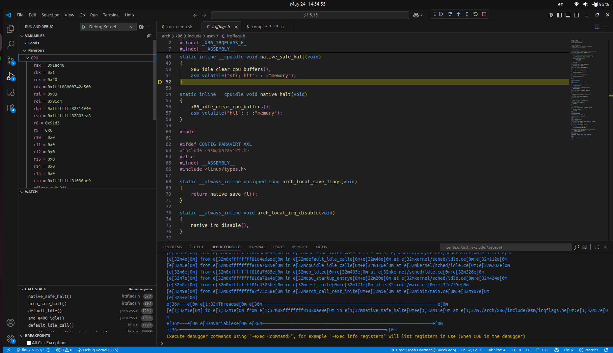
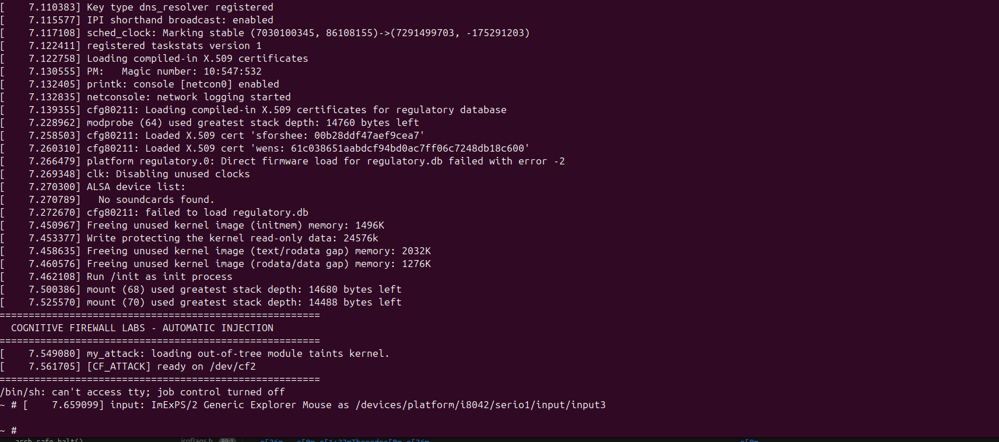

# Directory Overview

4.7/, 4.8/, 4.9/: Historical research environments. These directories contain the source code and PoCs used to study specific kernel vulnerabilities and exploit techniques relevant to these versions.   

5.15/: Current active research environment. This version serves as the baseline for testing hypervisor-based isolation mechanisms (VMX/EPT).   

lkm/: Contains my custom Loadable Kernel Modules (LKM) developed for kernel introspection and security research.   

exploits/: A collection of proof-of-concept exploits developed during my study of kernel-level vulnerabilities.   

my_rootfs/: The root filesystem used for testing and validation within the virtualized environments.   

# Workflow & Documentation Build Automation:

 Use compile_5_15.sh to build the current research kernel.   
 Testing: All kernel modules and PoCs are tested using the provided QEMU scripts (run_qemu.sh).   
 
 Version History: Historical versions (4.7-4.9) are preserved to maintain the integrity of the research timeline and permit regression testing of specific vulnerability patterns.   

# Some images

